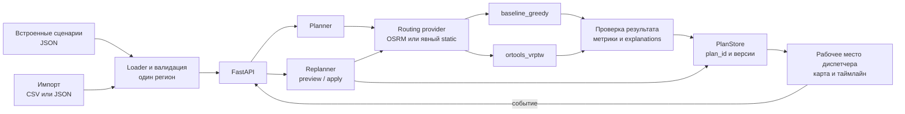

# Архитектура решения

## Назначение

Проект — локально запускаемый веб-монолит для диспетчера выездных бригад.
FastAPI обслуживает API и статический интерфейс, оба алгоритма работают в
одном backend-процессе, а версии планов хранятся в памяти. Такое устройство
сокращает число движущихся частей в демонстрации и сохраняет единый контракт
между расчётом, картой и объяснениями.

## Схема

## Компоненты

| Компонент | Ответственность |
|---|---|
| `backend/app/main.py` | HTTP API, проверка моделей запросов, обработка ошибок и раздача UI. |
| `services/loader.py` | Три встроенных региона, изоляция ID и реестр импортов в памяти. |
| `services/scenario_import.py` | Разбор UTF-8 CSV/JSON, нормализация и проверка обязательных полей. |
| `services/travel_matrix.py` | Один `RoutingProvider` для времени, расстояния, KPI и GeoJSON маршрутов. |
| `services/baseline_greedy.py` | Официальный baseline: входной порядок и первая допустимая бригада. |
| `services/ortools_vrptw.py` | Многодепотный VRPTW с открытыми маршрутами, приоритетами и hard constraints. |
| `services/planner.py` | Запуск движка и сравнение baseline/OR-Tools на одном входе и `matrix_id`. |
| `services/replanner.py` | Локальная вставка обычной заявки и пересчёт хвоста после события. |
| `services/plan_store.py` | `plan_id`, версии, история, одноразовые preview и защита от stale apply. |
| `frontend/` | Карта, маршруты, таймлайн, KPI, explanations, импорт и события. |

## Основные потоки

### Построение плана

1. UI передаёт `scenario`, `engine` и лимит решения в `POST /plans`.
2. Loader возвращает копии заявок и бригад только одного региона.
3. Planner один раз создаёт routing provider. Один и тот же объект получает
   baseline и OR-Tools, поэтому сравнение использует одинаковые дуги.
4. Backend добавляет метрики, причины неназначения, explanations и геометрию
   выбранных маршрутов.
5. PlanStore создаёт версию 1; UI показывает её на карте и в расписании.

### Импорт сценария

`POST /scenarios/import` принимает тело CSV или JSON и имя файла в заголовке
`X-Filename`. Валидный файл регистрируется как изолированный `import-*`
сценарий. Импорт не смешивается со встроенными регионами и живёт до перезапуска
backend. Пример: [`data/examples/mvp_import.json`](data/examples/mvp_import.json).

### Перепланирование

1. UI отправляет событие и `base_version` в
   `POST /plans/{plan_id}/events/preview`.
2. Replanner сохраняет завершённые и текущие этапы, пересчитывая только
   допустимую оставшуюся часть дня.
3. Preview возвращает план-кандидат и человеческий diff, но не меняет текущую
   версию.
4. `POST /plans/{plan_id}/events/apply` применяет preview один раз и создаёт
   дочернюю версию с `parent_plan_id`.
5. `POST /plans/{plan_id}/reoptimize` заново оптимизирует данные текущей
   версии, поэтому уже применённые новые заявки не теряются.

## API

| Метод | Endpoint | Назначение |
|---|---|---|
| `GET` | `/health` | Проверка доступности backend. |
| `GET` | `/data/scenarios` | Встроенные и импортированные сценарии. |
| `GET` | `/data/jobs?scenario=...` | Заявки выбранного региона. |
| `POST` | `/scenarios/import` | Импорт одного регионального CSV/JSON. |
| `POST` | `/optimize` | Расчёт без сохранения версии. |
| `POST` | `/plans` | Расчёт и создание версии 1. |
| `GET` | `/plans/{plan_id}` | Чтение сохранённого плана. |
| `GET` | `/plans/{plan_id}/history` | История одной цепочки версий. |
| `POST` | `/plans/{plan_id}/events/preview` | Предпросмотр события. |
| `POST` | `/plans/{plan_id}/events/apply` | Одноразовое применение preview. |
| `POST` | `/plans/{plan_id}/reoptimize` | Новая версия из текущего набора данных. |

## Маршрутизация и согласованность данных

По умолчанию backend работает с OSRM в режиме fail-closed. OSRM Table даёт
матрицу расстояний и времени, а OSRM Route — GeoJSON для тех же упорядоченных
дуг. В ответе присутствует `matrix_id`; сумма `distance_m` сегментов совпадает
с KPI маршрута. `ROUTING_PROVIDER=static` включает явную offline-модель
Haversine. Она не выдаёт прямые связи за дорожную геометрию.

Внешняя сеть требуется для публичного OSRM, тайлов карты и геокодирования.
OR-Tools, FastAPI, встроенные данные и детерминированные тесты работают
локально; тесты используют static provider.
