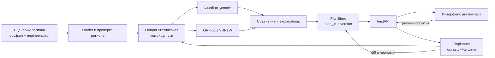

# Архитектура решения

`beeline-integration` — самодостаточный демонстрационный монолит: FastAPI
обслуживает API и статический интерфейс диспетчера. Планирование выполняется в
процессе backend, версии плана хранятся в памяти.

## Компоненты

| Компонент | Назначение |
|---|---|
| `backend/app/main.py` | HTTP API, раздача интерфейса и проверка входных моделей. |
| `services/loader.py` | Allowlist регионов, загрузка заявок и бригад, проверка регионального namespace. |
| `services/travel_matrix.py` | Единая неизменяемая матрица расстояний и времени для baseline и OR-Tools. |
| `services/baseline_greedy.py` | Официальный first-fit baseline. |
| `services/ortools_vrptw.py` | Приоритетный многодепотный VRPTW с открытыми маршрутами. |
| `services/planner.py` | Запуск выбранного движка и честное сравнение на одном входе и матрице. |
| `services/replanner.py` | Пересчёт оставшегося дня после события и построение явного diff. |
| `services/plan_store.py` | In-memory версии планов и одноразовые preview. |
| `frontend/index.html`, `frontend/src/*` | Карта, расписание, сравнение, explanation и сценарии событий. |

## Основные потоки

### Статическое планирование

1. UI отправляет регион, движок и лимит времени в `POST /plans`.
2. Loader возвращает только данные выбранного региона.
3. Planner создаёт одну матрицу пути и передаёт её baseline и OR-Tools.
4. Backend возвращает маршруты, метрики, причины неназначения, explanations и
   сравнение с baseline.
5. PlanStore присваивает `plan_id` и `version=1`; UI отображает эту версию.

### Перепланирование

1. UI отправляет событие и текущую версию в
   `POST /plans/{plan_id}/events/preview`.
2. Replanner фиксирует завершённые и текущие этапы, затем рассчитывает только
   оставшийся хвост смены.
3. Preview содержит предложенный план и категории diff, но не меняет текущую
   версию.
4. `POST /plans/{plan_id}/events/apply` применяет preview один раз и создаёт
   дочернюю версию с `parent_plan_id`.

## API

| Метод | Endpoint | Назначение |
|---|---|---|
| `GET` | `/health` | Проверка доступности. |
| `GET` | `/data/scenarios` | Три разрешённых региона. |
| `GET` | `/data/jobs?scenario=...` | Заявки выбранного региона. |
| `POST` | `/optimize` | Расчёт без сохранения версии. |
| `POST` | `/plans` | Расчёт и создание v1. |
| `GET` | `/plans/{plan_id}` | Текущая версия плана. |
| `GET` | `/plans/{plan_id}/history` | История цепочки версий. |
| `POST` | `/plans/{plan_id}/events/preview` | Безопасный preview события. |
| `POST` | `/plans/{plan_id}/events/apply` | Одноразовое применение preview. |

Backend и фиксированный demo-emergency работают без внешних API. Тайлы карты,
поиск адреса и дорожная геометрия интерфейса могут использовать публичные
сервисы, но не изменяют backend-метрики.
