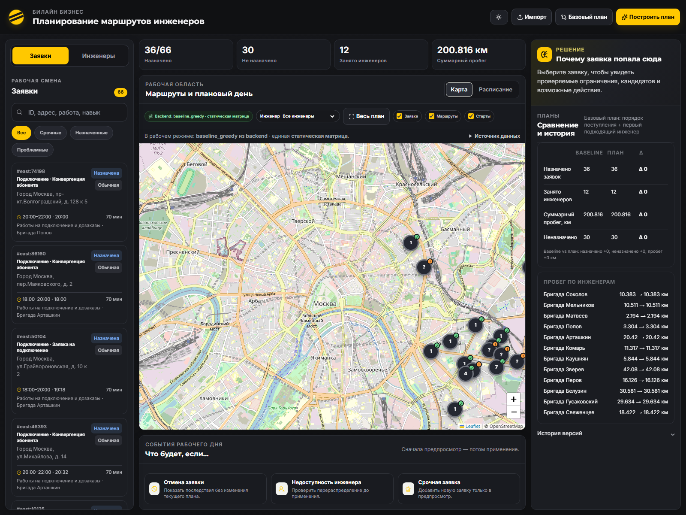

# Фаза 2, шаг 1: первый вертикальный срез

Дата проверки: 23 сентября 2026 года.

## Результат

В `beeline-integration` собрано минимально запускаемое приложение: FastAPI отдаёт
сценарий `east`, рассчитывает официальный `baseline_greedy` и обслуживает
перенесённый интерфейс по `/`. Основная кнопка расчёта получает план через
`POST /optimize`; локальный `buildPlan()` больше не является путём основного
расчёта.

Исходные каталоги `beeline-api`, `beeline-backend`, `beeline-data` и
`beeline-frontend` не изменялись.

## Запуск

Требуется CPython 3.11 или новее. Команды выполняются из корня workspace:

```powershell
cd beeline-integration
python -m venv .venv
.\.venv\Scripts\python.exe -m pip install -r requirements.txt
.\.venv\Scripts\python.exe -m uvicorn app.main:app --app-dir backend --host 127.0.0.1 --port 8000
```

После запуска:

- интерфейс: `http://127.0.0.1:8000/`;
- OpenAPI: `http://127.0.0.1:8000/docs`;
- проверка состояния: `http://127.0.0.1:8000/health`.

## Реализованные части

### Backend и данные

- `backend/app/main.py` — FastAPI, маршруты `/`, `/health`, `/data/jobs` и
  `/optimize`;
- `backend/app/services/loader.py` — загрузка только подготовленного сценария
  `east`;
- `backend/app/services/travel_matrix.py` — единая статическая матрица расстояний
  и времени для всего расчёта;
- `backend/app/services/baseline_greedy.py` — официальный жадный baseline;
- `backend/app/services/validation.py` — проверка согласованности построенного
  плана;
- `data/scenarios/east/` — 66 заявок и 12 инженеров сценария `east`.

### Frontend

Интерфейс перенесён из `beeline-frontend/frontend/index.html` без смены
композиции и визуального стиля. Удалён внедрённый Kaspersky-скрипт. Отсутствующий
в исходнике файл логотипа заменён уже предусмотренным CSS-вариантом знака.

Добавлены два небольших интеграционных модуля:

- `frontend/src/api.js` вызывает backend;
- `frontend/src/plan_adapter.js` переводит канонический ответ API в модель
  существующего интерфейса.

`runPlanning()` вызывает `BeelineApi.optimize("east")`, а затем отображает
маршруты, метрики и объяснения backend. Кнопки «Построить план» и «Базовый план»
используют этот путь. При первой загрузке страницы он также выполняется
автоматически. Скопированная локальная реализация `buildPlan()` сохранена внутри
HTML как неактивный код прежнего интерфейса; основной расчёт и обработчики двух
кнопок её не вызывают.

## Контракт API в этом срезе

### `GET /health`

Ответ `200 OK`:

```json
{"status":"ok","service":"beeline-integration"}
```

### `GET /data/jobs?scenario=east`

Ответ `200 OK` содержит `scenario`, `count` и исходный массив `jobs`. В
проверенном наборе `count` равен 66. Неизвестный сценарий возвращает `404`.

### `POST /optimize`

Запрос:

```json
{"scenario":"east","engine":"baseline_greedy"}
```

Ответ содержит:

- `engine`, `solver_status`, дату, часовой пояс и допущения;
- заявки с назначением, плановыми временами и объяснением либо структурированной
  причиной неназначения;
- инженеров;
- маршруты со стартовой точкой и последовательностью остановок;
- для каждой остановки — физическое прибытие, начало и конец работ, путь,
  ожидание и длительность работ;
- общие и поинженерные метрики;
- `baseline_metrics`, равные `metrics`, поскольку в этом срезе доступен только
  baseline;
- описание модели пути `travel_model`.

Причины неназначения имеют код, сообщение, число проверенных инженеров и набор
обнаруженных ограничений. Поддержаны коды `NO_AVAILABLE_ENGINEER`, `NO_SKILL`,
`NO_VEHICLE`, `OUT_OF_WINDOW`, `OUT_OF_SHIFT`, `INVALID_COORDINATES` и общий
`NO_FEASIBLE_ASSIGNMENT`.

## Правило baseline и модель пути

Алгоритм обрабатывает заявки строго по `input_order`, сохраняя входной порядок
при равенстве. Для каждой заявки инженеры проверяются строго в порядке
`engineers.json`; назначается первый допустимый инженер.

Обязательные проверки: статус доступности, навык, требуемый транспорт, время в
пути от текущей позиции, начало работ внутри клиентского окна и завершение до
конца смены. Раннее прибытие превращается в ожидание. Заявки со статусом
`completed`, `done` или `cancelled` исключаются из планирования.

Статическая матрица заранее рассчитывает каждую пару точек сценария для типов
транспорта. Расстояние оценивается по Haversine с единым дорожным коэффициентом,
время — по фиксированной скорости транспорта. Backend и baseline обращаются к
одному экземпляру этой матрицы. Нормативные 20 минут дороги поверх результата
матрицы не добавляются.

Маршруты в этом срезе открытые: возвращение в стартовую точку после последней
заявки не рассчитывается.

## Проверки

Автоматические проверки:

```powershell
.\.venv\Scripts\python.exe -m pytest -q
node --check frontend/src/api.js
node --check frontend/src/plan_adapter.js
```

Результат: `6 passed` за 0,48 секунды. Единственное предупреждение относится к
устаревающему alias `anyio.abc.BlockingPortal` внутри `starlette.testclient`, а
не к коду приложения. Тесты проверяют официальный порядок baseline, ограничения
по навыку, транспорту, окну и смене, отсутствие дополнительных 20 минут и полный
HTTP-путь.

Ручная HTTP-проверка работающего процесса:

| Проверка | Результат |
|---|---|
| `GET /health` | `200`, status `ok` |
| `GET /data/jobs?scenario=east` | `200`, 66 заявок |
| `POST /optimize` | `200`, `baseline_greedy` |
| `GET /` | `200`, интерфейс от FastAPI |

Для текущих входных данных baseline назначил 36 заявок из 66, оставил 30
неназначенными, задействовал 12 инженеров и рассчитал 200,816 км пути, 448 минут
движения, 3125 минут ожидания и 2050 минут работ.

UI открыт по локальному адресу и дополнительно отрисован в Microsoft Edge в
headless-режиме. На экране отображаются полученные от backend 66 заявок,
маршруты, метрики, статусы и объяснения:



## Ограничения этого среза

- поддерживается только подготовленный сценарий `east`;
- реализован только `baseline_greedy`, поэтому сравниваемые baseline и текущий
  план совпадают;
- OR-Tools VRPTW, PlanStore и динамическое перепланирование отсутствуют;
- оборудование, зоны и импорт произвольных CSV не учитываются;
- модель пути статическая и офлайн, без дорожного графа и пробок;
- в данных `east` нет заявок с обязательным транспортом; само ограничение
  реализовано и проверено отдельным тестовым набором;
- большие значения ожидания являются следствием официального first-fit baseline:
  инженер может приехать раньше окна и ждать начала работы;
- внешние CDN-ресурсы интерфейса и тайлы карты требуют доступ в интернет;
- старые кнопки импорта и демонстрационных сценариев оставлены ради визуальной
  целостности, но сообщают, что функции не входят в текущий срез.

