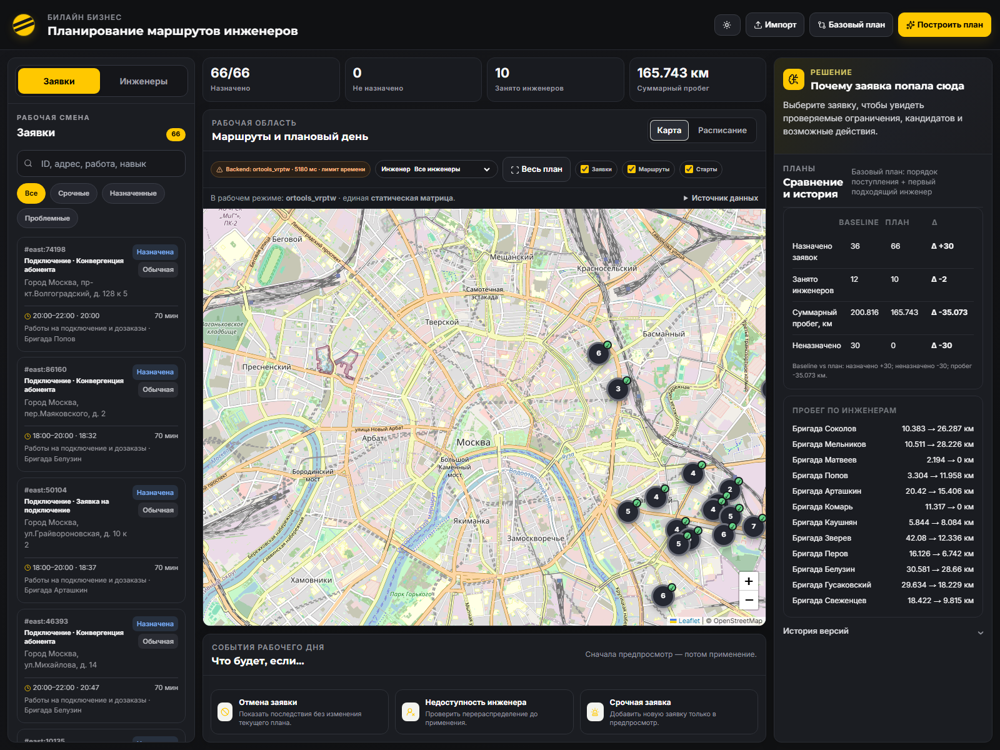

# Фаза 2, шаг 2: статический OR-Tools VRPTW

Дата проверки: 23 сентября 2026 года.

## Результат этапа

В `beeline-integration` добавлен реальный движок `ortools_vrptw` на Google
OR-Tools 9.14.6206. Официальный `baseline_greedy` сохранён: заявки по-прежнему
обрабатываются во входном порядке и назначаются первому допустимому инженеру.
Единственное интеграционное расширение baseline — возможность получить уже
построенный экземпляр общей матрицы; правило назначения от этого не изменилось.

Оба движка получают одни и те же исходные массивы `east`, один экземпляр
`StaticTravelMatrix` и одинаковые длительности работ. Поле `matrix_id` для
проверенного запуска: `aef6a3ac07c24141`. Флаг
`service_norm_travel_added=false` подтверждает, что нормативные 20 минут поверх
расчётного пути не добавляются.

## Запуск

Из корня workspace:

```powershell
cd beeline-integration
python -m venv .venv
.\.venv\Scripts\python.exe -m pip install -r requirements.txt
.\.venv\Scripts\python.exe -m uvicorn app.main:app --app-dir backend --host 127.0.0.1 --port 8000
```

Интерфейс доступен по `http://127.0.0.1:8000/`, OpenAPI — по
`http://127.0.0.1:8000/docs`.

Примеры обоих расчётов:

```powershell
Invoke-RestMethod -Method Post -ContentType application/json `
  -Body '{"scenario":"east","engine":"baseline_greedy"}' `
  http://127.0.0.1:8000/optimize

Invoke-RestMethod -Method Post -ContentType application/json `
  -Body '{"scenario":"east","engine":"ortools_vrptw","solve_time_limit_ms":5000}' `
  http://127.0.0.1:8000/optimize
```

## Изменения

- В `requirements.txt` закреплён `ortools==9.14.6206`.
- `backend/app/services/ortools_vrptw.py` строит открытый многодепотный VRPTW
  с необязательными заявками.
- `backend/app/services/planner.py` создаёт общую матрицу, запускает точный
  baseline и выбранный движок, затем формирует сравнение и дельты.
- `backend/app/main.py` переключает движки по полю `engine` и возвращает явную
  структурированную ошибку, если OR-Tools недоступен или завершился с ошибкой.
- `backend/app/services/validation.py` независимо проверяет уникальность
  назначений, навык, транспорт, окно, смену, длительность, ожидание, порядок и
  итоговые метрики.
- `frontend/src/api.js` отправляет выбранный engine.
- `frontend/src/plan_adapter.js` использует текущий план и отдельные реальные
  метрики baseline из блока `comparison`.
- В существующем `frontend/index.html` кнопка «Построить план» запускает
  `ortools_vrptw`, а «Базовый план» — `baseline_greedy`. Компоновка и визуальный
  стиль не менялись.
- Карта, расписание, карточки заявок, причины и объяснения строятся по результату
  выбранного движка. Правая панель показывает фактические baseline, plan и delta.

## Модель OR-Tools

Каждый инженер является отдельной машиной со своей стартовой точкой и типом
транспорта. Конечная точка виртуальная: дуга после последней заявки имеет нулевые
расстояние и дорогу, поэтому возврат в офис не требуется.

Временной transit равен длительности предыдущей работы плюс пути до следующей
точки. Cumul в узле заявки представляет начало работы. Его диапазон совпадает с
клиентским окном, slack моделирует ожидание при раннем прибытии, а конечный cumul
ограничен концом смены. Поэтому длительность последней работы также обязательно
помещается в смену.

Допустимые машины заявки ограничены доступностью инженера, навыком и
`required_vehicle`, когда он задан. Статусы `completed`, `done` и `cancelled`
не передаются solver.

Цель реализована целочисленными весами с доказуемыми для данного конечного
набора верхними границами:

1. штраф за пропуск одной заявки больше максимально возможной стоимости всех
   машин и всего расстояния;
2. фиксированная стоимость одной используемой машины больше верхней границы
   суммарного расстояния;
3. после этого минимизируется расстояние в метрах.

Это обеспечивает заданный порядок целей внутри модели MVP. Поиск ограничен по
времени, поэтому приложение возвращает лучший найденный допустимый план и не
заявляет математический глобальный оптимум.

## API

`POST /optimize` принимает:

```json
{
  "scenario": "east",
  "engine": "ortools_vrptw",
  "solve_time_limit_ms": 5000
}
```

Ответ текущего движка содержит `engine`, `solver_status`,
`solver_status_detail`, `solve_time_ms`, `warnings`, маршруты, заявки,
объяснения, причины неназначения, метрики и `comparison`.

`comparison` содержит отдельные блоки `baseline`, `optimized`, `plan`, общий
`shared_matrix_id`, подтверждение `same_input` и `delta_plan_minus_baseline`.
При недоступной библиотеке или ошибке API возвращает HTTP 503/500 с
`engine=ortools_vrptw`, статусом и предупреждением. Greedy в этом случае не
подставляется.

## Проверки

Команды:

```powershell
.\.venv\Scripts\python.exe -m pytest -q
node --check frontend/src/api.js
node --check frontend/src/plan_adapter.js
```

Дополнительно синтаксически проверен встроенный JavaScript `index.html`, а оба
движка вызваны через работающий HTTP-сервер.

Результат: `17 passed` за 2,01 секунды. Четыре предупреждения исходят из
Starlette TestClient и SWIG-обёртки OR-Tools, тестовых отказов нет.

Исполняемые тесты подтверждают:

1. назначение выполнимой заявки реальным OR-Tools;
2. запрет при отсутствии навыка и несовпадении обязательного транспорта;
3. запрет при нарушении окна или смены;
4. явное ожидание при раннем прибытии;
5. допустимое завершение последней работы ровно в конце смены;
6. разные фактические `engine` и статусы baseline/OR-Tools;
7. общий `matrix_id` и отсутствие дополнительных 20 минут;
8. исключение закрытых заявок и отсутствие возврата в офис;
9. порядок целей: покрытие раньше числа инженеров, затем расстояние.
10. явный HTTP 503 без маршрутов baseline, если OR-Tools недоступен.

HTTP-проверка:

| Проверка | Результат |
|---|---|
| `GET /health` | `200`, `ok` |
| `GET /data/jobs?scenario=east` | `200`, 66 заявок |
| `GET /` | `200`, интерфейс FastAPI |
| baseline `/optimize` | `200`, `baseline_greedy` |
| optimized `/optimize` | `200`, `ortools_vrptw` |

Интерфейс отрисован в Microsoft Edge после ответа backend:



## Результаты east

Параметр поиска OR-Tools: 5000 мс.

| Метрика | baseline_greedy | ortools_vrptw | План − baseline |
|---|---:|---:|---:|
| Назначено заявок | 36 | 66 | +30 |
| Неназначено заявок | 30 | 0 | −30 |
| Задействовано инженеров | 12 | 10 | −2 |
| Суммарное расстояние, км | 200,816 | 165,743 | −35,073 |
| Время в пути, мин | 448 | 301 | −147 |
| Ожидание, мин | 3125 | 1204 | −1921 |
| Работы, мин | 2050 | 3560 | +1510 |

Baseline рассчитан за 6 мс. Полный вызов OR-Tools занял 5084 мс, из которых
поиск использовал заданный пятиисекундный лимит. Ответ:
`solver_status=time_limit_feasible`, `solver_status_detail=ROUTING_SUCCESS`.
API явно предупреждает, что возвращён лучший найденный допустимый план и
глобальный оптимум не подтверждён.

## Честный вывод

На сценарии `east` OR-Tools улучшил все три целевые метрики: покрыл на 30 заявок
больше, использовал на двух инженеров меньше и сократил открытый суммарный путь
на 35,073 км. Все 66 активных заявок назначены. Это сравнение одного
зафиксированного набора и общей статической матрицы; оно не доказывает
глобальную оптимальность и не переносится автоматически на другие данные.

## Ограничения

- поддерживается только встроенный сценарий `east`;
- `solve_time_limit_ms=5000` — **ASSUMPTION MVP**; допустимый диапазон API
  ограничен 100–30000 мс;
- расстояния и время являются статической Haversine-оценкой с дорожным
  коэффициентом и фиксированной скоростью транспорта;
- при равном числе заявок модель не различает их бизнес-приоритеты: текущая цель
  этапа максимизирует именно общее покрытие;
- оборудование, зоны, пробки, внешние routing API, импорт CSV, PlanStore и
  динамическое перепланирование не реализованы;
- маршруты открытые, поэтому обратный путь после последней заявки не входит в
  расстояние;
- найденный план воспроизводим для текущих данных и настроек, но при другом
  лимите поиска допустимый маршрут и расстояние могут измениться.
