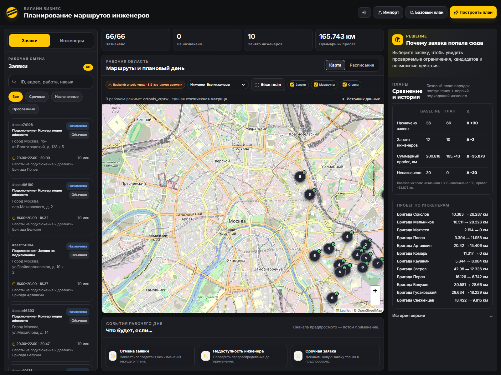

# Фаза 2, шаг 3: безопасное перепланирование east

Дата проверки: 24 сентября 2026 года.

## Результат

В `beeline-integration` реализовано версионное перепланирование оставшейся части
рабочего дня для трёх событий:

1. отмена заявки;
2. недоступность инженера;
3. новая срочная аварийная заявка.

Расчёт события разделён на два запроса: preview не меняет текущий план, apply
атомарно создаёт следующую версию. Каждый применённый план содержит уникальный
`plan_id`, номер `version` и `parent_plan_id` предыдущей версии. Повторный
`event_id`, повторный apply и preview от устаревшей версии отклоняются HTTP 409.

Исходные каталоги `beeline-api`, `beeline-backend`, `beeline-data` и
`beeline-frontend` не изменялись.

## Запуск

```powershell
cd beeline-integration
python -m venv .venv
.\.venv\Scripts\python.exe -m pip install -r requirements.txt
.\.venv\Scripts\python.exe -m uvicorn app.main:app --app-dir backend --host 127.0.0.1 --port 8000
```

Интерфейс: `http://127.0.0.1:8000/`.

Проверки:

```powershell
.\.venv\Scripts\python.exe -m pytest -q
node --check frontend/src/api.js
node --check frontend/src/plan_adapter.js
```

Встроенный JavaScript `frontend/index.html` также проверяется командой
`node --check` после извлечения последнего inline-блока.

## Добавленные компоненты

### PlanStore

`backend/app/services/plan_store.py` хранит планы, цепочки версий, preview и
применённые `event_id` в памяти одного процесса. Операции защищены локальной
блокировкой.

- `POST /plans` создаёт v1;
- `GET /plans/{plan_id}` возвращает конкретную версию;
- `GET /plans/{plan_id}/history` возвращает всю цепочку;
- `POST /plans/{plan_id}/events/preview` рассчитывает неподтверждённую версию;
- `POST /plans/{plan_id}/events/apply` применяет один конкретный preview.

Новая версия получает новый `plan_id`; `parent_plan_id` указывает на версию, из
которой она была создана. Preview содержит `base_plan_id`, `base_version`,
`proposed_version`, новый план и diff, но до apply не входит в историю.

### Перепланировщик

`backend/app/services/replanner.py` делит текущий маршрут относительно
`event_time`:

- `completed`, `done` и `cancelled` исключаются из нового solver-run;
- этап, который уже начат или находится в состоянии `en_route`, фиксируется за
  тем же инженером;
- если статус не задан явно, текущий этап определяется по сохранённым временам
  прибытия, начала и окончания;
- старт оставшегося маршрута переносится в последнюю фактическую точку и на
  время не раньше события или завершения зафиксированного этапа;
- недоступный инженер завершает текущий этап, после чего не получает новые
  остановки;
- OR-Tools или baseline рассчитывает только оставшийся хвост.

Карта и таймлайн получают объединение зафиксированного текущего этапа и нового
хвоста. Завершённые этапы остаются в данных версии со статусом `completed`, но
не входят в новый маршрут и его remaining-day метрики.

### Аварийная заявка

Backend формирует заявку сам:

- `id = emergency:{event_id}`;
- `skill = emergency`;
- `duration_min = 80`;
- `window_start = event_time`;
- `window_end = event_time + 2 часа`;
- приоритет — срочный;
- обязательный транспорт применяется только когда передан в событии.

Использование верхней границы реакции в два часа — **ASSUMPTION MVP** внутри
подтверждённого диапазона 1–2 часа.

### Явный diff

Backend возвращает отдельные массивы:

- `assigned` — новые назначения;
- `unassigned` — снятые с назначения;
- `reassigned` — сменившие инженера;
- `reordered` — изменившие порядок у того же инженера;
- `delayed` — получившие более позднее начало;
- `cancelled` — отменённые заявки.

Каждая запись содержит `job_id`, фактические до/после поля и понятное сообщение.
`diff.items` объединяет записи для UI, а `diff.summary` содержит счётчики.

### Frontend

Визуальная композиция сохранена. Подключены существующие карточки «Отмена
заявки», «Недоступность инженера» и «Срочная заявка».

Основной поток UI:

1. создаёт v1 через `POST /plans`;
2. отправляет событие на backend preview;
3. показывает до/после и backend diff без изменения карты;
4. применяет preview отдельной кнопкой;
5. заменяет карту, таймлайн, метрики, заявки и объяснения данными новой версии;
6. добавляет v2 в существующую полосу истории.

Во время apply статус preview сразу меняется на `applying`, поэтому двойной клик
не запускает второй запрос. Backend независимо защищает операцию от повторов и
устаревших версий.

Контрольная отрисовка текущего интерфейса и подключённых карточек:



## Сохранение статического контракта

`POST /optimize` не изменён и по-прежнему честно переключает
`baseline_greedy`/`ortools_vrptw`. На финальном прогоне `east` получены прежние
результаты:

| Движок | Назначено | Инженеров | Расстояние, км |
|---|---:|---:|---:|
| `baseline_greedy` | 36 | 12 | 200,816 |
| `ortools_vrptw` | 66 | 10 | 165,743 |

У OR-Tools сохранился статус `time_limit_feasible`; глобальный оптимум не
заявляется. В метрики добавлен только совместимый блок
`per_engineer_jobs_count`, необходимый для точного объединения зафиксированного
этапа с remaining-day baseline. Существующие поля и значения сохранены.

## Результаты проверок

`pytest`: **24 passed**, 4 предупреждения зависимостей, 0 ошибок. Предупреждения
относятся к Starlette TestClient и SWIG-обёртке OR-Tools.

Проверены:

- отменённая заявка отсутствует в новом маршруте;
- завершённая заявка не передаётся в повторный solver-run;
- недоступный инженер завершает текущий этап и теряет хвост маршрута;
- авария не прерывает `in_progress`;
- авария получает навык `emergency`, 80 минут и окно от события до +2 часов;
- один `event_id` и один preview нельзя применить дважды;
- второй preview от той же base version становится stale после применения
  первого;
- frontend вызывает preview/apply API, читает backend diff и показывает новую
  версию;
- все прежние baseline/OR-Tools тесты продолжают проходить.

Финальная HTTP-проверка подтвердила:

- `/health` — `ok`;
- создание плана — v1;
- preview отмены — proposed v2 и одна запись `cancelled`;
- apply — v2 с корректным `parent_plan_id`;
- отменённая заявка отсутствует во всех маршрутах v2;
- история содержит v1 и v2.

Отдельный прогон на оптимизированном `east` отменил будущую заявку
`east:17349`: preview явно показал 1 отмену, 16 переназначений, 7 перестановок и
10 задержек. Эти числа относятся к конкретному запуску с лимитом повторного
решения 1000 мс и могут измениться при другом лимите; сами категории diff
остаются стабильными.

## Демо-сценарий

1. Открыть UI и дождаться v1 `ortools_vrptw`: 66 назначенных заявок.
2. В блоке «Что будет, если…» выбрать «Отмена заявки».
3. Указать 13:30 и будущую заявку из маршрута.
4. Нажать расчёт. Текущая карта остаётся v1, ниже появляется preview v1 → v2 с
   метриками и явным списком изменений.
5. Нажать «Применить и создать v2».
6. Проверить, что карта и расписание показывают новый маршрут, отменённая заявка
   помечена и отсутствует в маршрутах, а в истории доступны v1 и v2.
7. Повторить демонстрацию с недоступным инженером в 13:30: текущий этап остаётся
   у него, дальнейшие заявки получают diff.
8. Для аварии указать адрес, подтвердить координаты, выбрать время события и
   открыть preview. В карточке новой заявки будут 80 минут, emergency skill и
   окно до +2 часов.

## Известные ограничения

- PlanStore хранится только в памяти одного процесса и очищается при рестарте;
- нет БД, межпроцессной синхронизации и восстановления после сбоя;
- фактические телематические координаты отсутствуют: `en_route` и текущий этап
  определяются по статусу и плановым временам;
- для уже начатого пути в remaining-day метриках сохраняется исходная полная
  входящая дуга, без оценки пройденной доли;
- отмена и недоступность могут перестроить весь незавершённый хвост, но каждое
  изменение обязательно раскрывается в diff;
- preview не резервирует ресурсы: его защищает проверка base version при apply;
- аварийное окно фиксировано на двух часах и пока не настраивается;
- поддерживается только `east`; импорт CSV, оборудование, зоны, пробки и внешние
  routing API не добавлялись;
- геокодирование новой аварии в UI использует существующий внешний Photon и
  требует интернет; backend API принимает готовые координаты и работает офлайн;
- интерактивный браузерный e2e-фреймворк не добавлялся: UI проверен визуальной
  отрисовкой, JavaScript syntax check и исполняемым API/frontend contract test.

